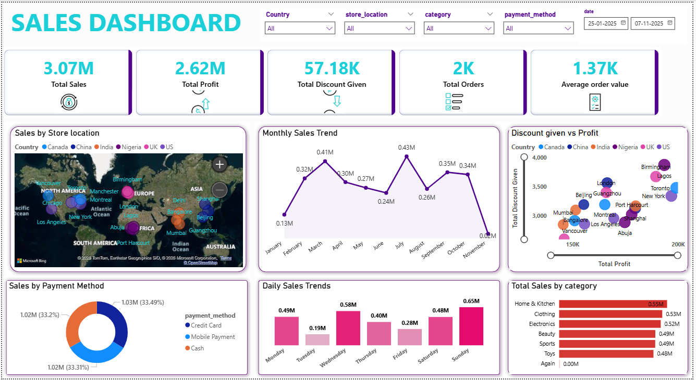

# Sales Performance Dashboard (Power BI)

An interactive sales analytics dashboard built to analyze revenue, 
profit, discounts, and order trends across countries, stores, 
categories, and payment methods.

## Tools Used
- SQL – data import, cleaning, and analysis
- Power BI – dashboard design and visualization
- DAX – calculated measures (KPIs, trend calculations)

## Dataset
Raw sales data provided as separate CSV files per country, imported 
into SQL for cleaning and analysis before being loaded into Power BI.

- Countries: Canada, China, India, Nigeria, UK, US
- Time period: Jan 2025 – Nov 2025
- Fields: Store Location, Category, Payment Method, Sales, Profit, 
  Discount, Order Date

## Key Metrics
- Total Sales: 3.07M
- Total Profit: 2.62M
- Total Discount Given: 57.18K
- Total Orders: 2K
- Average Order Value: 1.37K

## Dashboard Features
- KPI cards for Sales, Profit, Discount, Orders, and AOV
- Sales by store location (interactive map)
- Monthly and daily sales trend analysis
- Discount given vs profit (bubble chart by country)
- Sales by payment method (donut chart)
- Total sales by category (bar chart)
- Filters: Country, Store Location, Category, Payment Method, Date range

## Dashboard Preview

## Project Workflow
1. Imported the 6 country-wise CSV files into SQL
2. Cleaned and analyzed the data using SQL queries (`sales_analysis.sql`)
3. Built DAX measures for dynamic KPI calculations in Power BI
4. Designed an interactive, filter-driven dashboard

## What I Learned
- Writing SQL queries to import and clean multi-country raw data
- Building DAX measures for dynamic KPI calculations
- Designing an interactive, filter-driven Power BI report
- Translating raw data into business-relevant insights

## Files in this Repository
- `sales_dashboard.pbix` – Power BI dashboard file
- `sales_analysis.sql` – SQL scripts used for data import and cleaning
- `data/` – Raw country-wise CSV files (Canada, China, India, Nigeria, UK, US)
- `sales_dashboard.png` – Dashboard screenshot
- `LICENSE` – License for this repository

## Connect with Me
- LinkedIn: [linkedin.com/in/om-kshirsagar-data](https://linkedin.com/in/om-kshirsagar-data)
- GitHub: [kshirsagar-droid](https://github.com/kshirsagar-droid)
